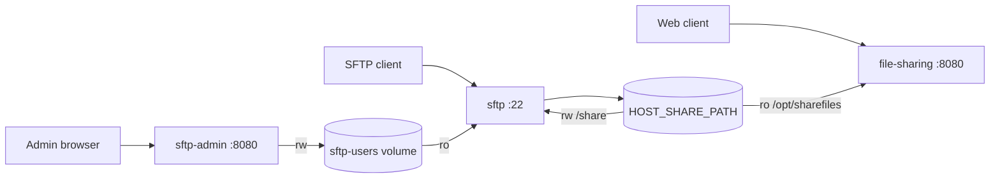

# System Architecture

## Overview

`simple-fileurl` has one read-only web service and two SFTP services. The web service serves hash-based downloads from a shared directory. The SFTP service writes uploads into the same directory. The Admin service manages the SFTP user manifest.

## Components

### `file-sharing`

- Scans `/opt/sharefiles/${SHARE_PREFIX}`.
- Mounts the host share read-only.
- Serves `GET /<directory-hash>/<file-hash>` downloads.
- Exposes `GET /healthz` for health checks.
- Runs as the existing non-root web process.

### `sftp`

- Mounts the host share read-write at `/share`.
- Uses `/share` as the OpenSSH chroot root.
- Exposes only public-key SFTP sessions through `internal-sftp`.
- Reads `sftp-users/users.json` and reconciles accounts without restart.
- Stores effective authorized keys outside the chroot at `/etc/ssh/authorized_keys.d/`.

### `sftp-admin`

- Binds to `127.0.0.1:${SFTP_ADMIN_PORT:-8081}` by default.
- Requires `SFTP_ADMIN_PASSWORD`.
- Is the only manifest writer and first-boot seeder.
- Has no host share mount and does not access `/etc/passwd` or `/etc/ssh`.
- Delivers generated private keys once from process memory; only public keys enter the manifest.

## Storage And Permissions

| Data | Web | SFTP | Admin |
|---|---:|---:|---:|
| Host share at `/opt/sharefiles` or `/share` | `ro` | `rw` | no mount |
| `sftp-users` volume | no mount | `ro` | `rw` |
| Local Linux accounts and authorized keys | no access | owns/reconciles | no access |

The chroot root must be `root:root` and not writable by group or other users. The `${SHARE_PREFIX}` directory must use `SFTP_GID`, be setgid, and be group-writable. SFTP uses `umask 0002`, producing regular files equivalent to `0664` and directories equivalent to `0775`. This lets the non-root web process read uploaded content.

## User Reconciliation

1. Admin atomically writes a complete manifest through temporary file plus rename.
2. SFTP polling notices the manifest change.
3. Enabled users are created or retained as login-less Linux accounts.
4. Each enabled user's public keys are written atomically as `root:sftpusers` `0640` files outside the chroot.
5. Disabled or removed users lose their effective authorized-key file.
6. OpenSSH accepts or rejects the next connection using the reconciled state.

Invalid manifests and per-user failures preserve the previous valid key state where possible.

## Hash URL Model

The hash input never contains the host path or a container absolute path.

- Directory hash: logical directory, for example `files/mydir`.
- File hash with `HASH_TARGET=file`: file bytes.
- File hash with `HASH_TARGET=filename`: basename, for example `report.pdf`.
- Supported algorithms: `md5` and `sha256`.

Changing the host mount location does not change links as long as the logical tree remains the same. With `HASH_TARGET=file`, overwriting a file changes its link identity.

## Security Boundaries

- Web share links are bearer links; anyone with the full URL can download.
- Web sees the share read-only, so it cannot modify uploaded data.
- SFTP sessions have no password auth, shell, PTY, agent forwarding, TCP forwarding, or X11 forwarding.
- The SFTP chroot prevents access to host absolute paths.
- Admin private keys are never persisted or logged.
- Remote Admin access must use TLS or a private network; do not expose the default localhost binding publicly.
